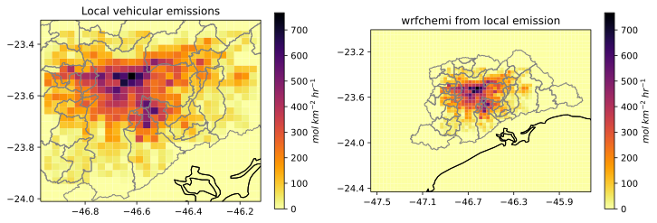

# aas4wrf.py

`aas4wrf.py` is a Python script to create the `wrfchemi` file from local emissions needed to run WRF-Chem model. It's based on his older broder [AAS4WRF.ncl](https://github.com/alvv1986/AAS4WRF).
Currently, It works with CBMZ/MOSAIC chemical mechanism and for surface emissions.

## Installation

You need to install the packages that `aas4wrf.py` needs. We recommend to use
[miniconda](https://docs.conda.io/en/latest/miniconda.html) or
[anaconda](https://docs.anaconda.com/anaconda/install/)

You can download this repo or clone it by:

```
git clone https://github.com/quishqa/AAS4WRF.py.git
```

Then add `conda-forge` channel by:

```
conda config --add channels conda-forge
```

To avoid conflicts during the installation, we also recommend create a new environment to run `aas4wrf.py`:

```
conda create --name aas4wrf
conda activate aas4wrf
```


### Option A

Now you can install `espmy`, `xesmf` and `pyyaml`. By doing this, `xarray`,
`numpy`,  and `pandas`will be also installed:

```
conda install esmpy
conda install xesmf
conda install pyyaml
```

It's important to first install `esmpy` to avoid [this issue](https://github.com/JiaweiZhuang/xESMF/issues/47#issuecomment-593322288).


### Option B
Or, you can install the packages located in `requirements.txt` by typing:

```
conda install --yes --file requirements.txt
```

If everything goes well, you are ready to go.

## The input data
To run this script you need the `wrfinput_d0x` and your temporal and spatial disaggregated emissions in **mol/km2/hr**. You can see the needed format by exploring `emissions.txt` file.

## Configuration file: `aas4wrf.yml`
This file control some parameters to run the script. `""` are required only in `sep`.
* `wrfinput_file`: the location of wrfinput_d0x.
* `emission_file`: the location of the local emission file.
* `nx` and `ny`: the number of longitude and latitude points in which local emission were spatially disaggregated.
* `cell_area`: cell area in km<sup>2</sup> of input `emission_file`.
* `start_date` and `end_date`: `emissions.txt` temporal availability in `%Y-%m-%d %H:%M` format.
* `header`: If your local emission file has a header.
* `col_names`: Names of emission file column names. **Remember that the three
first columns have to be named "i", "lon", and "lat"**.
* `sep`: Column delimiter in emission file. Use quotes (`""`)
* `method`: we implement `nearest_s2d` methods for emissions regridding
(a conservative method is on the way!).
* `output_name` : location and name of produced `wrfchemi` file

## Usage

To run the script, type:
```
python aas4wrf.py aas4wrf.yml
```

### Output example
Here there is a comparison between the local emission of CO (with &Delta;X= 3 Km) and the
output after using `aas4wrf.py` for a WRF domain of &Delta;X = 3 km.



### Expected Runtime

For a WRF domain with 150 x 100 points and for ten days with hourly emissions  (nx =30 and ny=27, like the above figure), in a "normal" laptop, it took 30 seconds to run.
